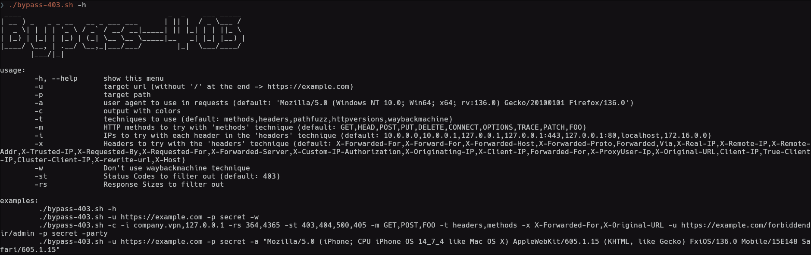
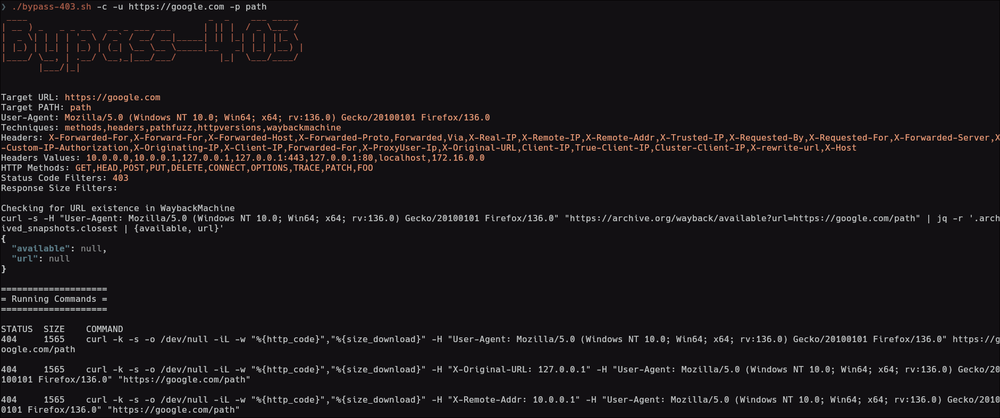

# Bypass-403  
Inspired by [this repo](https://github.com/iamj0ker/bypass-403), I made my own script to bypass 403.  
The features are all displayed in the help menu:  
  
Example run:  
  
  
# Installation  
```bash  
sudo apt install -y jq curl
git clone https://github.com/jakored1/bypass-403.git
cd bypass-403
chmod +x ./bypass-403.sh
./bypass-403.sh --help
```  
